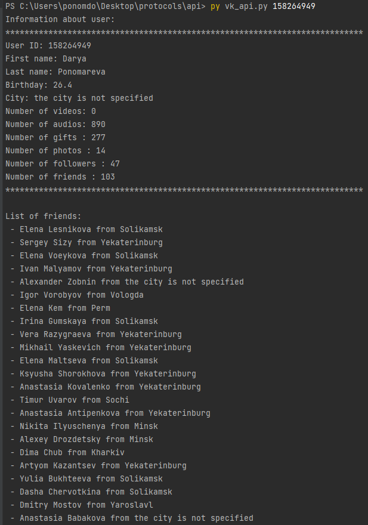
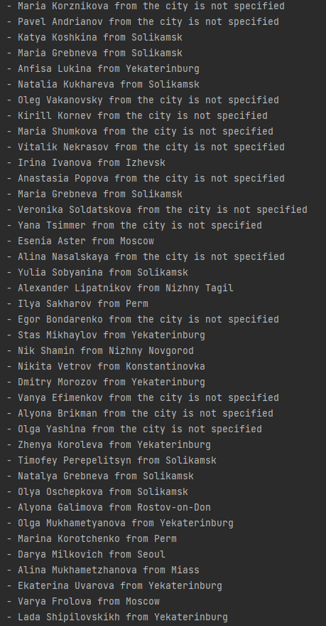

# Задача 8. Использование API VK

## Oписание  
Используя vk api, можно получить общие сведения о пользователе и список его друзей (с определением их города, если он указан)

## Запуск  
Предварительно необходимо получить access token, например [здесь](https://vkhost.github.io/). И поместить его в файл token.txt   
`py vk_api.py {user_id}`
 
## Пример запуска   
  
  